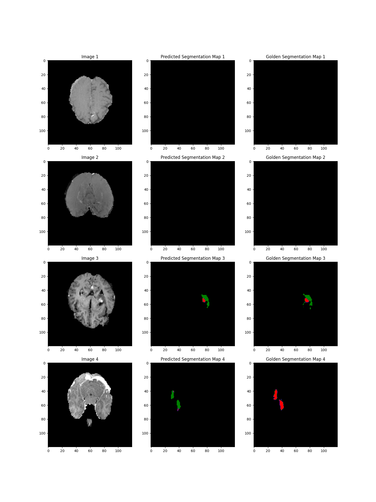

# UNet-BrainTumour-Detection
Coursework for 3rd year module COMP60006: Computer Vision

## Description
A U-net model was created in PyTorch for with the appropriate encoder and decoder paths. The model was trained and tested on a brain tumour detection dataset. The project involved visualising the dataset, implementing a class and member functions to load data for training/testing, building the U-net architecture and deploying it on the test set.

The encoder path consisted of 4 dimension-preserving convolution laers interleaved with 3 downsampling convolution layer. The downsampling was implemented through the convolution stride. The decoder path reflected the encoder path with 4 dimension-preserving convolution laers interleaved with 3 upsampling transposed-convolution layers

Categorical Cross-Entropy Loss was used as the loss function and was optimised using the Adam optimiser.

## Dataset
The dataset for the project can be found here: https://www.dropbox.com/s/zmytk2yu284af6t/Task01_BrainTumour_2D.tar.gz

## Sample Results

